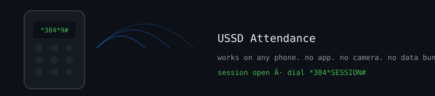

# USSD Attendance




Attendance signing over USSD — works on any feature phone, no app install, no smartphone required.

## Why USSD

QR-based attendance fails the students who need it most: shared phones, no camera, no data bundle. USSD is already how most of Kenya does banking. This meets that reality.

## How it works

1. Lecturer starts a session → short code + session code issued
2. Student dials the USSD string on any phone
3. Server verifies enrollment, session state, and rate limits
4. Attendance recorded in Postgres; lecturer dashboard updates

## Security

- JWT for admin/lecturer APIs
- bcrypt for credentials
- Enrollment checks before write
- Rate limiting on the USSD gateway endpoint
- Firebase Admin for push/status where available

## Stack

- Node.js + Express 5
- PostgreSQL
- Firebase Admin
- JWT + bcrypt

## Run

```bash
npm install
cp .env.example .env
npm run migrate
npm run dev
npm test
```

## License

ISC
